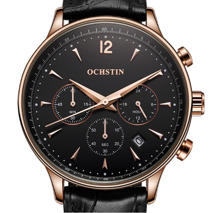
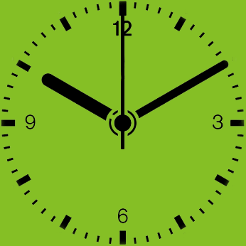

<!DOCTYPE html>
<html>
<head>
    <title>Contact Us</title>
    
    <link href="http://maxcdn.bootstrapcdn.com/font-awesome/4.1.0/css/font-awesome.min.css" rel="stylesheet">
</head>
<body>
    

        <nav>
          <a href="home.html"><h1>SWATCH</h1></a>
          <ul>
            <a href="#"><li class="select">Home</li></a>
            <a href="#"><li class="select">Shop</li></a>
            <a href="#"><li class="select">Contact Us</li></a>
            <a href="#"><li class="select">About Us</li></a>
            <a href="#"><li class="select">Login | Register</li></a>
          </ul>
          <ul id="swatches">
            <li><i class="fa fa-shopping-cart" style="padding: 15px 15px;background-color: red;"></i></li>
          </ul>
        </nav>
  

  

    

        <h2 class="heading2">Contact us on: +230-5828-1552</h2>
    

    

    

        <form>
            <fieldset>
                <legend>Contact Form</legend>
                  
                
Name*

                <input type="text" placeholder="John Smith" required="">
                
E-mail*

                <input type="email" placeholder="mail@example.com" required="">
                
Subject

                <input type="text" placeholder="Subject" required="">
                
Comment
 
                <textarea required="" placeholder="Write your comment here..."></textarea>  
                <button class="buttonCon">Send</button>
            </fieldset>
        </form>
    

    
    
</body>
</html>
